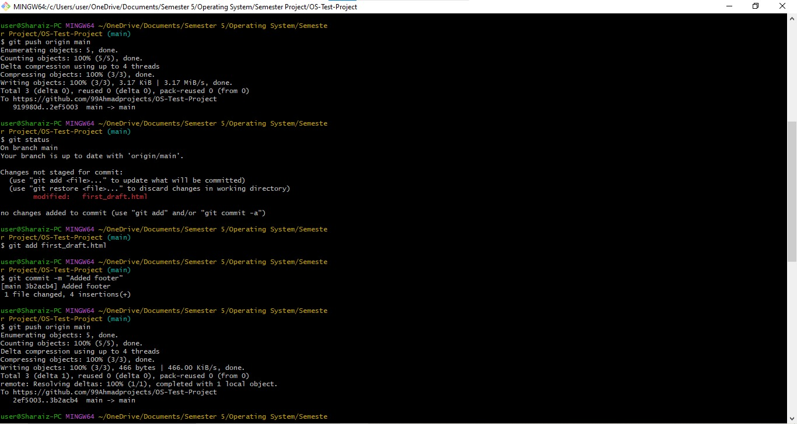

# Collaborative Web Project of OS

> A simple, modern, and responsive single-page website created as a collaborative project for the Operating Systems course by students of BSCS 5-1 at Riphah International University.

This project serves as a practical demonstration of teamwork and collaborative development using Git and GitHub. Each team member was assigned a specific role HTML structure, CSS styling, and JavaScript interactivity to build a cohesive and functional webpage.

## Demo

<p align="center">
  
</p>

---

## Mir Ahmad Shah Git Screenshots


---

## Sharaiz Ahmed Git Screenshots



---

## Shahid Zaman Git Screenshots


---

## ✨ Key Features

* **📱 Responsive Design:** The layout is fully responsive and looks great on all devices, from mobile phones to desktop screens.
* **🖱️ Interactive UI:** Smooth scrolling, a mobile-friendly hamburger menu, and active navigation link highlighting create a dynamic user experience.
* **💻 Clean & Semantic Code:** The project is built with a well-organized and meaningful HTML structure, which is beneficial for accessibility.
* 🎨 **Modern Styling with Tailwind CSS:** The user interface is styled using the utility-first Tailwind CSS framework for a clean and modern aesthetic.

---

## 🛠️ Technologies & Tools Used

* **HTML5:** For the core structure and content of the webpage.
* **CSS3:** For custom styling and enhancements.
* **[Tailwind CSS](https://tailwindcss.com/):** A utility-first CSS framework for rapid UI development.
* **JavaScript:** For handling DOM manipulation, event listening, and interactive features like the mobile menu and scrollspy navigation.
* **Git & GitHub:** For version control and collaborative workflow management.

---

## 🧑‍💻 Team Members & Contributions

This project was a collective effort. Here's a breakdown of the team and each member's primary responsibility:

| Name           | Student ID | Contribution                                                                                                     |
| :------------- | :--------- | :--------------------------------------------------------------------------------------------------------------- |
| **Sharaiz Ahmed** | `[57288]`  | **HTML Structure:** Developed the foundational HTML markup and organized the content into semantic sections.     |
| **Shahid Zaman** | `[55123]`  | **CSS & Styling:** Handled the visual design, responsiveness, and styling using Tailwind CSS and custom CSS rules. |
| **Mir Ahmad Shah** | `[54906]`  | **JavaScript Interactivity:** Implemented the JavaScript logic for the mobile menu toggle and the active navigation link highlighting on scroll. |

---

## 🚀 Getting Started

To run this project locally, simply clone the repository and open the `first_draft.html` file in your web browser.

```bash
# Clone the repository
git clone [https://github.com/99Ahmadprojects/OS-Test-Project.git](https://github.com/99Ahmadprojects/OS-Test-Project.git)

# Navigate to the project directory
cd OS-Test-Project
